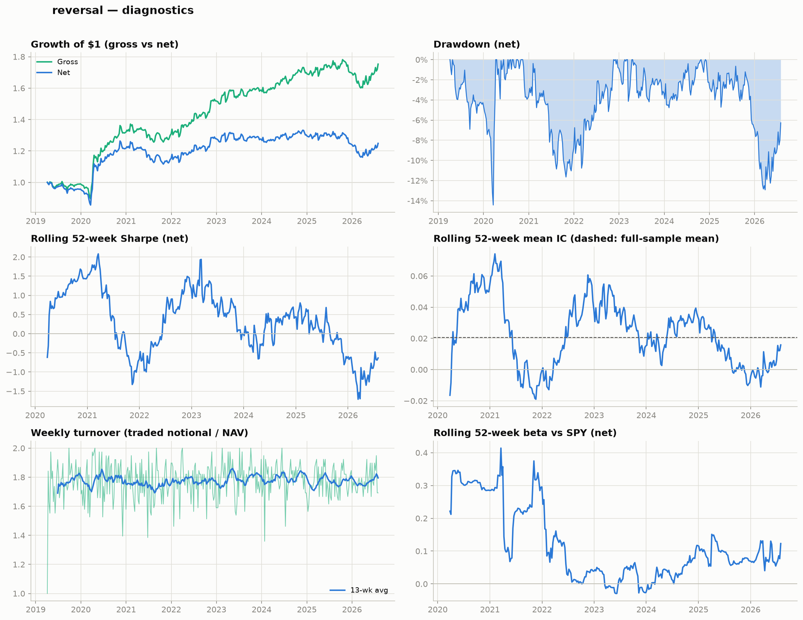
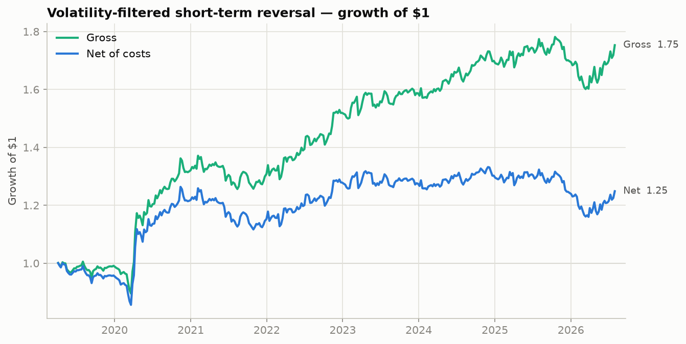
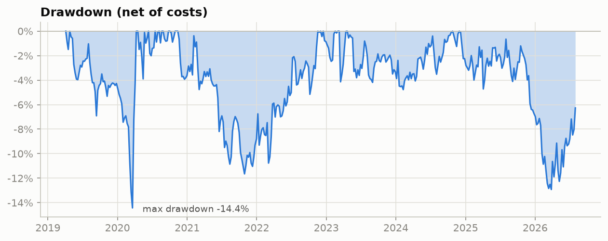
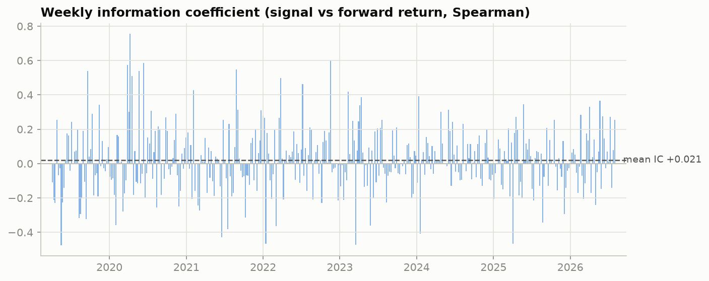
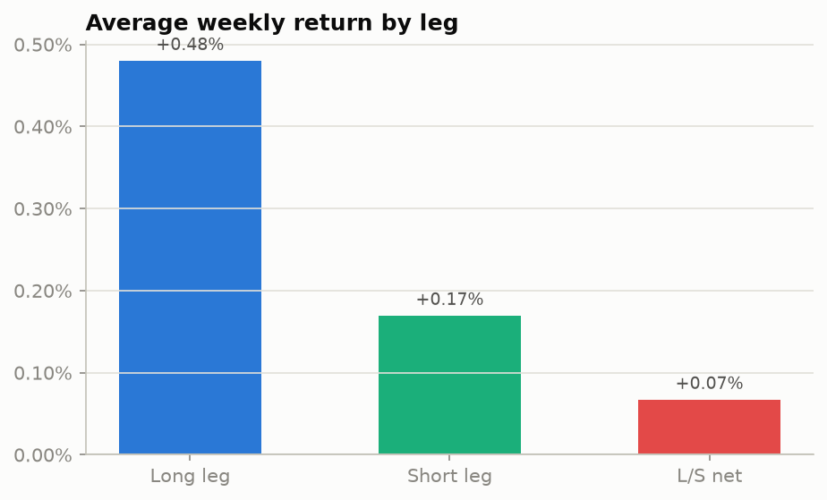

# Testing the Short-Term Reversal Anomaly After Costs and Volatility Filtering

**A config-driven factor research framework, applied to a weekly market-neutral reversal strategy on S&P 500 equities (2019–2026).**

Independent quantitative research project. Reversal is the primary study; momentum and low-volatility run through the identical engine as comparison factors (see [Factor framework](#factor-framework)).

## Architecture

```
        Yahoo Finance / Wikipedia
                   │
                   ▼
            Data loader                quant_research/data.py      (universe, prices, caching)
                   │
                   ▼
           Signal registry             quant_research/signals.py
           ├── reversal   (5-day)
           ├── momentum   (6-1)
           └── low_vol    (63-day)
                   │   ◄── configs/<factor>.yaml  (params, filter, portfolio, costs)
                   ▼
          Portfolio engine             quant_research/engine.py    (weekly L/S deciles, vol screen)
                   │
                   ▼
            Cost model                 quant_research/engine.py    (bps × traded notional)
                   │
                   ▼
             Metrics                   quant_research/metrics.py   (Sharpe, IC, bootstrap, sub-periods)
                   │
                   ▼
    Dashboard + research report        quant_research/plots.py, report.py
                   │
                   ▼
   results/<factor>/{report.md, dashboard.png, weekly.csv} + results/comparison.md
```

## Research question

Do stocks that underperformed over the past week outperform over the next week — and does filtering out high-volatility stocks leave a strategy with risk-adjusted excess returns **after transaction costs**?

Short-term reversal is a well-documented cross-sectional anomaly (Jegadeesh 1990; Lehmann 1990). The goal here is not to "discover" a signal, but to test whether a known effect remains economically meaningful once tradability is taken seriously.

## Data

- Daily auto-adjusted close prices from Yahoo Finance (`yfinance`)
- Universe: current S&P 500 constituents (from Wikipedia), 490 tickers after a 70% data-coverage filter
- Sample: 2019-01-01 to 2026-07-31 → **383 non-overlapping weekly holding periods** (2019-04 to 2026-07)
- Benchmark: SPY, measured over the *exact same* holding windows as the strategy

## Strategy (primary: reversal)

At the last trading day of each week, using only information available up to that day:

1. **Signal**: `signal = −(past 5-day return)` (reversal)
2. **Volatility screen**: drop the top 20% of stocks by trailing 21-day realized volatility
3. **Portfolio**: long the top decile of the signal, short the bottom decile, equal-weighted, 0.5 gross per side → ~1x gross, dollar-neutral (~39 names per side on average)
4. **Holding period**: until the next weekly rebalance (~5 trading days); periods tile the sample exactly, so weekly returns are non-overlapping
5. **Costs**: 5 bps per side charged on **actual traded notional** (`Σ|Δw| × 5 bps`), not a flat fee — average realized turnover is 1.77x/week → ~8.9 bps/week, a **4.9%/yr cost drag**

All parameters live in [`configs/reversal.yaml`](configs/reversal.yaml); nothing is hard-coded in the engine.

## Results

| | Ann. return | Ann. vol | Sharpe | Max drawdown | Hit rate |
|:--|--:|--:|--:|--:|--:|
| **Gross** | 7.92% | 9.57% | 0.83 | −10.97% | 54.6% |
| **Net of costs** | 3.06% | 9.56% | 0.32 | −14.43% | 51.2% |

**Bootstrap 95% CI** (net, 2,000 iid draws, seed 42): annualized return **[−3.6%, +10.5%]**, Sharpe **[−0.39, +1.02]** — both span zero, consistent with the CAPM alpha result below.

**Signal quality (weekly cross-sectional Spearman IC):**

- Mean IC **+0.021**, IC std 0.186, **ICIR 0.110**, t-stat of mean IC **+2.15**, 54.3% of weeks positive

**CAPM regression (net weekly returns vs SPY):**

- Alpha: +0.018%/week (**+0.91% annualized**), t = 0.27, p = 0.79 → *not statistically significant*
- Beta: **+0.156** (t = 6.13), R² = 0.09 → close to market-neutral, with a small residual long-market tilt

**Sub-period analysis — did the effect survive?**

| Period | Weeks | Gross ann. | Net ann. | Net Sharpe | Mean IC |
|:--|--:|--:|--:|--:|--:|
| 2019–2021 | 144 | 10.19% | 5.27% | 0.43 | +0.016 |
| 2022–2024 | 156 | 9.10% | 4.15% | 0.56 | +0.029 |
| 2025–2026 | 83 | 1.99% | −2.60% | −0.32 | +0.012 |

Performance weakened in the most recent sub-period, and net of costs it turned negative there. This is descriptive: no formal structural-break test was performed, and weaker recent performance could also reflect regime differences (volatility, trendiness) or sampling variation rather than decay of the anomaly itself.

### Conclusion

> The reversal signal is statistically real — mean IC is positive and significant (t ≈ 2.2) and the gross Sharpe is 0.83 — but **its economic edge does not survive realistic transaction costs**. At 5 bps per side and ~1.8x weekly turnover, costs consume roughly 60% of gross returns, and net-of-cost alpha is indistinguishable from zero. This is consistent with the literature: short-term reversal profits are heavily turnover-dependent and have decayed in large-cap universes.

### Charts

Six-panel diagnostics (cumulative return, drawdown, rolling 52-week Sharpe, rolling 52-week IC, turnover, rolling beta):








The full research note — hypothesis, methodology, metrics, interpretation, limitations, regression appendix — is **generated automatically** for every factor run: [`results/reversal/report.md`](results/reversal/report.md) (weekly series: [`results/reversal/weekly.csv`](results/reversal/weekly.csv)). The interpretation section is rule-based, derived from the computed statistics, so it cannot drift out of sync with the numbers.

## Factor framework

The engine is signal-agnostic: any function `(prices, **params) → score panel` registered in `signals.py` runs through the same rebalance / filter / portfolio / cost / IC machinery, parameterized by a YAML config. Two comparison factors are included:

| Factor | Net ann. | Net Sharpe | Max DD | Mean IC | IC t-stat | Alpha (ann.) | Alpha p | Beta | Turnover/wk |
|:--|--:|--:|--:|--:|--:|--:|--:|--:|--:|
| **reversal** | 3.06% | 0.32 | −14.4% | +0.021 | 2.15 | +0.91% | 0.79 | +0.16 | 1.77 |
| **momentum** (6-1) | −1.55% | −0.15 | −21.1% | +0.006 | 0.52 | −0.75% | 0.85 | −0.02 | 0.56 |
| **low_vol** | −12.79% | −0.83 | −69.0% | −0.017 | −1.24 | −3.87% | 0.37 | −0.53 | 0.21 |

Notable: reversal is the only factor with a statistically significant IC in this sample; low-vol's large negative return comes with a −0.53 market beta (short high-beta names in a strong bull market), illustrating why raw returns without a risk regression are misleading. Full table: [`results/comparison.md`](results/comparison.md); auto-generated research notes in `results/<factor>/report.md` with dashboards alongside.

## Reproducing results

```bash
git clone <this repo> && cd <repo>
python -m venv venv && source venv/bin/activate
pip install -e ".[dev]"

pytest                                        # 26 unit tests (signals, metrics, costs/turnover)
quant-backtest                                # primary study (reversal)
quant-backtest --config configs/momentum.yaml # any single factor
quant-backtest --all                          # every config + comparison table
```

- **Expected runtime**: ~2–3 minutes on the first run (downloads ~7.5 years of daily prices for ~500 tickers, cached to `data/`); **~10 seconds per subsequent run** from cache.
- **Random seed**: 42 (bootstrap); all other computation is deterministic given the price data.
- **Output**: `results/<factor>/{report.md, dashboard.png, weekly.csv}`, `results/comparison.md`, and README charts in `charts/`.
- **Caveat**: Yahoo Finance data is not point-in-time; re-running at a later date extends the sample and can revise adjusted prices, so numbers will drift from those in this README (which reflect a 2026-08-01 run).

`python run_backtest.py` still works as an alias for `quant-backtest`.

## Repository layout

```
pyproject.toml         # installable package + `quant-backtest` console script
configs/               # one YAML per factor (hypothesis, signal params, filter, portfolio, costs)
  reversal.yaml
  momentum.yaml
  low_vol.yaml
quant_research/
  data.py              # universe (Wikipedia) + price download (yfinance), with caching
  signals.py           # signal registry (reversal, momentum, low_vol) + vol screen
  engine.py            # config-driven engine: rebalance loop, turnover-based costs, IC
  metrics.py           # Sharpe, drawdown, IC stats, bootstrap CIs, rolling stats, sub-periods
  plots.py             # matplotlib charts + 6-panel diagnostics dashboard (CVD-safe palette)
  report.py            # auto-generated research notes with rule-based interpretation
  cli.py               # `quant-backtest` entry point (--config / --all)
tests/                 # unit tests: signal logic, metrics, cost/turnover accounting
results/               # per-factor report.md + dashboard.png + weekly.csv, comparison.md
charts/                # standalone README charts for the primary study
```

## Design choices

- **Spearman (not Pearson) IC** — rank correlation matches how the portfolio is built (cross-sectional ranking) and is robust to return outliers.
- **Weekly (not daily) rebalance** — daily reversal turns over the book almost entirely each day; weekly keeps turnover (~1.8x/week) at a level where a bps-based cost model is still meaningful.
- **Equal weight (not risk parity)** — keeps the study about the signal, not the weighting scheme; a weighting overlay is an easy extension via the config.
- **Hold-to-next-rebalance (not fixed 5 days)** — holding periods tile the calendar exactly, so weekly returns are non-overlapping and regression standard errors are not inflated by overlap.
- **CAPM (not Fama–French)** — deliberate MVP scope; FF3/FF5 is listed as future work and would likely *shrink* the reported alpha further.

## Limitations

- **Survivorship bias**: the universe is *current* S&P 500 constituents, so stocks that were removed (often after poor performance) are missing. This likely flatters the long leg. A production study would use point-in-time constituents.
- **Simplified cost model**: flat 5 bps per side; no bid–ask spread modeling, market impact, borrow costs, or short-locate constraints. Real costs for the short leg would be higher.
- **No sector neutralization**: reversal returns may partly reflect sector mean-reversion.
- **Close-to-close execution**: assumes fills at the closing price on the rebalance day; no implementation lag.
- **No corporate-action point-in-time handling** beyond Yahoo's adjusted prices.
- **Single parameterization**: 5-day signal / 21-day vol / decile portfolios were fixed a priori (standard values from the literature, not optimized), but no sensitivity analysis across parameters is reported.

## Future work

- Point-in-time universe (e.g., historical index constituent files) to remove survivorship bias
- Spread-based cost model and turnover-reduction techniques (buffering, slower rebalance, signal blending)
- Sector-neutral ranking and Fama–French 3/5-factor regression instead of CAPM
- ML extension: walk-forward LightGBM on return/volatility/volume features, compared against this linear ranking baseline on IC and net Sharpe
