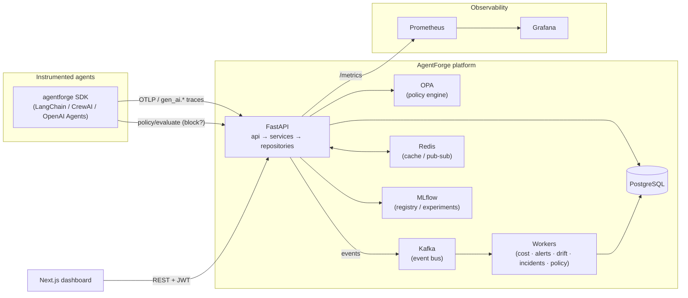
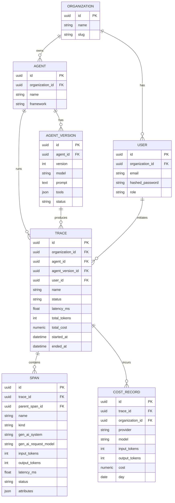
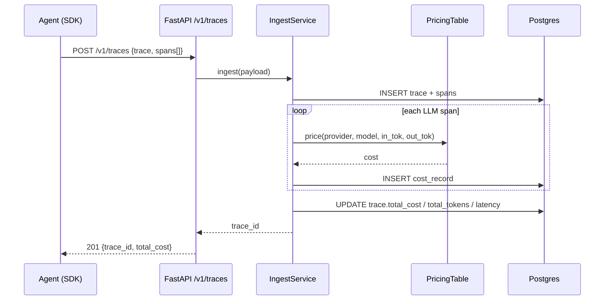
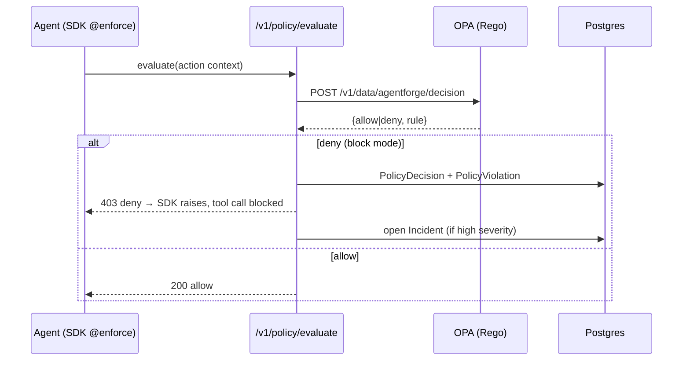
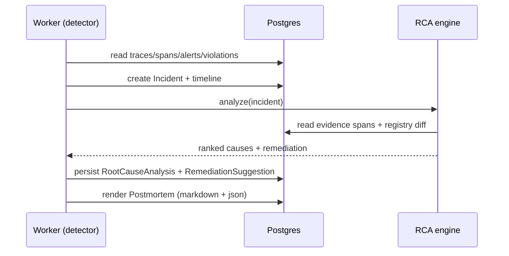

# AgentForge — Architecture

AgentForge is an AgentOps platform for observability, cost tracking, evaluation, governance,
and incident response of AI agents. This document describes the system design, the
clean-architecture layering, the data model, and the key runtime flows.

The build follows a **steel-thread-first, then phased** strategy (see [`../MVP.md`](../MVP.md)).

---

## 1. System overview



## 2. Clean architecture (backend)

```
api/         FastAPI routers — HTTP only, no business logic
  ↓ (dependency injection via Depends)
services/    business logic, orchestration, transactions
  ↓
repositories/ data access (repository pattern over SQLAlchemy)
  ↓
models/      SQLAlchemy ORM entities
schemas/     Pydantic request/response models (the API contract)
core/        config, db, security (JWT/RBAC), logging, otel, semconv
events/      Kafka producer + event types
integrations/ pricing tables, mlflow, evidently
```

Rules: routers never touch the ORM directly; services depend on repository interfaces;
repositories are the only layer that builds SQL. This keeps domains testable and swappable.

## 3. Event-driven flow

Trace ingestion is synchronous for persistence (so the client gets an id) and **asynchronous**
for derived work. The API publishes domain events to Kafka; workers consume them:

| Event | Consumer | Phase |
|-------|----------|-------|
| `trace.ingested` | cost aggregation | 1 |
| `metric.window.closed` | alert evaluation | 1 |
| `span.received` | policy evaluation | 2 |
| `alert.fired` / `policy.violation` | incident detection | 2 |
| `trace.sampled` | drift sampling | 4 |

In Phase 0 the cost calculation runs inline in the ingest service (no Kafka dependency) so the
steel thread has zero external moving parts beyond Postgres; Kafka is introduced in Phase 1.

## 4. Data model (ER)



> Phase 1+ adds: `ApiKey`, `AlertRule`/`Alert`/`AlertEvent`, `AuditLog`. Phase 2+ adds:
> `Policy`/`PolicyDecision`/`PolicyViolation`, `Incident`/`IncidentEvent`/`RootCauseAnalysis`/
> `RemediationSuggestion`/`Postmortem`. Phase 3+ adds `MCPServer`/`MCPTool`/`MCPCapability`,
> `EvaluationRun`/`EvaluationResult`, `Deployment`. Phase 4 adds `Experiment*`, `DriftReport`.

## 5. Key sequence — trace ingestion (Phase 0)



## 6. Key sequence — policy enforcement (Phase 2)



## 7. Key sequence — incident response (Phase 2)



## 8. Observability

- The SDK emits OpenTelemetry spans using **GenAI semantic conventions**
  (`gen_ai.system`, `gen_ai.request.model`, `gen_ai.usage.input_tokens`/`output_tokens`,
  `gen_ai.operation.name`, plus `gen_ai.agent.name` / `gen_ai.tool.name`). `core/semconv.py`
  is the single source of truth for these keys.
- The backend is itself instrumented with OpenTelemetry and exposes Prometheus metrics at
  `/metrics`. Grafana provisions dashboards for latency, cost, failure rate, and tokens.

## 9. Deployment topology

- **Local / demo**: `docker compose` (Postgres, Redis, Kafka, MLflow, OPA, Prometheus,
  Grafana, backend, worker, frontend).
- **Production**: Kubernetes via Helm chart; each service a Deployment + Service, ingress for
  API + frontend, secrets for DB/JWT, HPA on the API and workers. Cloud-ready for AWS/GCP
  (managed Postgres, managed Kafka, object storage for MLflow artifacts).
