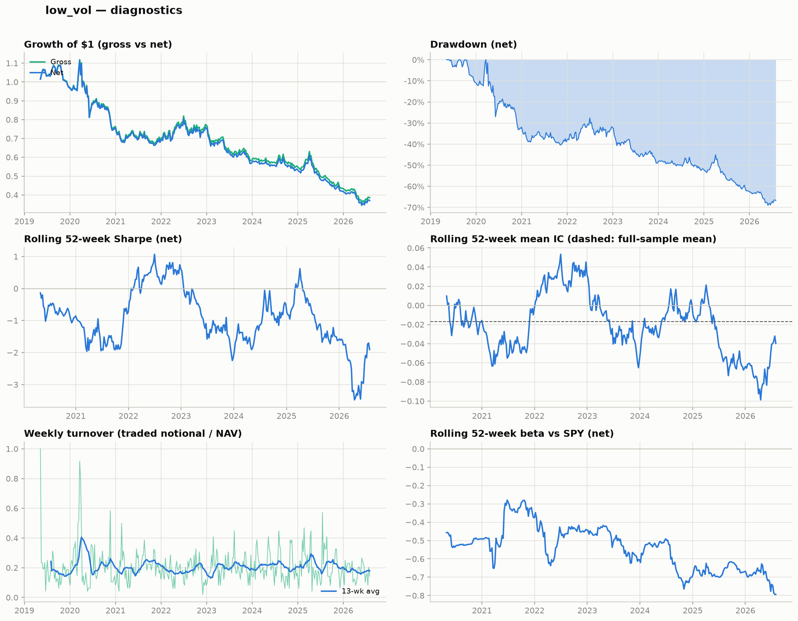

# low_vol — research note

*This report is generated automatically by `quant_research.report`.*

## Hypothesis

Low-volatility stocks earn higher risk-adjusted returns than high-volatility stocks (the low-volatility anomaly; Ang et al. 2006), implementable as a weekly dollar-neutral long/short portfolio net of costs.


## Methodology

- **Signal**: `low_vol` with parameters `{'window': 63}` (higher score → long candidate)
- **Volatility screen**: none (the signal itself is a volatility measure)
- **Portfolio**: long top 10% / short bottom 10% of the signal, equal-weighted, 0.5 gross per side (dollar-neutral)
- **Rebalance**: last trading day of each week; positions held until the next rebalance (non-overlapping holding periods)
- **Costs**: 5 bps per side on actual traded notional (`Σ|Δw| × fee`)
- **Universe**: current S&P 500 constituents with ≥70% price coverage
- **Sample**: 2019-05-10 to 2026-07-31 (378 weekly periods); average cross-section 488 stocks (49 long / 49 short)

## Performance

|              | Ann. return   | Ann. vol   |   Sharpe | Max drawdown   | Hit rate   |
|:-------------|:--------------|:-----------|---------:|:---------------|:-----------|
| Gross        | -12.32%       | 15.40%     |    -0.8  | -67.98%        | 46.56%     |
| Net of costs | -12.79%       | 15.40%     |    -0.83 | -69.02%        | 46.56%     |

- Average weekly turnover: 0.21x (avg cost 1.0 bps/week); annualized cost drag 0.47%
- Bootstrap 95% CI (net, 2000 draws, seed 42): ann. return [-22.28%, -2.53%], Sharpe [-1.51, -0.10]

### Sub-period analysis

|           |   Weeks | Gross ann.   | Net ann.   |   Net Sharpe |   Mean IC |
|:----------|--------:|:-------------|:-----------|-------------:|----------:|
| 2019–2021 |     139 | -12.48%      | -12.98%    |        -0.74 |    -0.008 |
| 2022–2024 |     156 | -7.60%       | -8.07%     |        -0.58 |    -0.008 |
| 2025–2026 |      83 | -20.31%      | -20.73%    |        -1.42 |    -0.049 |

### Signal quality (weekly Spearman IC)

- Mean IC -0.0170, IC std 0.2658, ICIR -0.064, t-stat -1.24, % positive weeks 47.6%

### CAPM regression (net returns vs SPY, weekly)

- Alpha -0.0759%/week (annualized -3.87%), t = -0.89, p = 0.374
- Beta -0.531 (t = -16.04), R² 0.406, N = 378

## Charts



## Interpretation

- The signal's predictive power is not statistically distinguishable from zero (mean IC -0.017, t = -1.24).
- Transaction costs reduce the Sharpe ratio from -0.80 to -0.83 (annualized cost drag 0.47%).
- Net-of-cost CAPM alpha is statistically indistinguishable from zero (-3.87%/yr, p = 0.374).
- Market beta of -0.53 is material: raw returns partly reflect market exposure rather than cross-sectional selection.
- The bootstrap 95% CI for the net Sharpe ratio [-1.51, -0.10] excludes zero.
- Performance weakened in the most recent sub-period (2025–2026: net Sharpe -1.42), though no formal structural-break analysis was performed.

## Limitations

- **Survivorship bias**: the universe is *current* S&P 500 constituents; stocks removed from the index (often after poor performance) are missing.
- **Simplified cost model**: flat fee per side on traded notional; no bid–ask spread, market impact, borrow costs, or short-locate constraints.
- **No sector neutralization**: cross-sectional ranks may partly reflect sector mean-reversion or sector trends.
- **Close-to-close execution**: assumes fills at the rebalance-day closing price with no implementation lag.
- **CAPM-only risk adjustment**: no Fama–French size/value/momentum controls.
- **No formal structural-break test**: sub-period results are descriptive.

## Appendix: full regression output

```
                            OLS Regression Results                            
==============================================================================
Dep. Variable:               strategy   R-squared:                       0.406
Model:                            OLS   Adj. R-squared:                  0.405
Method:                 Least Squares   F-statistic:                     257.2
Date:                Sat, 01 Aug 2026   Prob (F-statistic):           1.78e-44
Time:                        16:14:10   Log-Likelihood:                 1016.7
No. Observations:                 378   AIC:                            -2029.
Df Residuals:                     376   BIC:                            -2021.
Df Model:                           1                                         
Covariance Type:            nonrobust                                         
==============================================================================
                 coef    std err          t      P>|t|      [0.025      0.975]
------------------------------------------------------------------------------
const         -0.0008      0.001     -0.890      0.374      -0.002       0.001
spy_ret       -0.5314      0.033    -16.038      0.000      -0.597      -0.466
==============================================================================
Omnibus:                       45.806   Durbin-Watson:                   2.244
Prob(Omnibus):                  0.000   Jarque-Bera (JB):              159.754
Skew:                          -0.480   Prob(JB):                     2.04e-35
Kurtosis:                       6.037   Cond. No.                         39.1
==============================================================================

Notes:
[1] Standard Errors assume that the covariance matrix of the errors is correctly specified.
```
