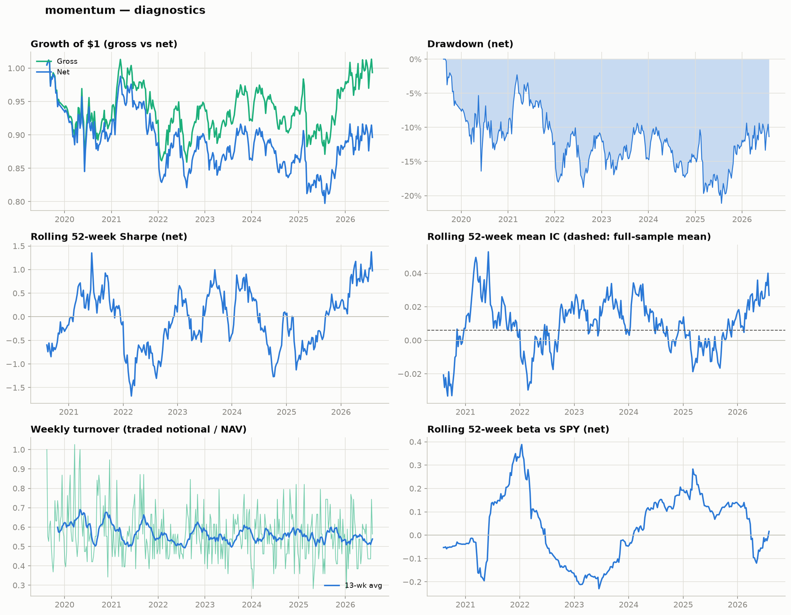

# momentum — research note

*This report is generated automatically by `quant_research.report`.*

## Hypothesis

Stocks with strong intermediate-horizon returns (past ~6 months, excluding the most recent month) continue to outperform at a weekly horizon (Jegadeesh & Titman 1993), net of transaction costs.


## Methodology

- **Signal**: `momentum` with parameters `{'lookback': 126, 'skip': 21}` (higher score → long candidate)
- **Volatility screen**: drop names above the 80% cross-sectional quantile of trailing 21-day realized volatility
- **Portfolio**: long top 10% / short bottom 10% of the signal, equal-weighted, 0.5 gross per side (dollar-neutral)
- **Rebalance**: last trading day of each week; positions held until the next rebalance (non-overlapping holding periods)
- **Costs**: 5 bps per side on actual traded notional (`Σ|Δw| × fee`)
- **Universe**: current S&P 500 constituents with ≥70% price coverage
- **Sample**: 2019-08-16 to 2026-07-31 (364 weekly periods); average cross-section 391 stocks (39 long / 39 short)

## Performance

|              | Ann. return   | Ann. vol   |   Sharpe | Max drawdown   | Hit rate   |
|:-------------|:--------------|:-----------|---------:|:---------------|:-----------|
| Gross        | -0.09%        | 10.21%     |    -0.01 | -15.36%        | 49.45%     |
| Net of costs | -1.55%        | 10.21%     |    -0.15 | -21.13%        | 49.18%     |

- Average weekly turnover: 0.56x (avg cost 2.8 bps/week); annualized cost drag 1.46%
- Bootstrap 95% CI (net, 2000 draws, seed 42): ann. return [-8.63%, 6.47%], Sharpe [-0.81, 0.68]

### Sub-period analysis

|           |   Weeks | Gross ann.   | Net ann.   |   Net Sharpe |   Mean IC |
|:----------|--------:|:-------------|:-----------|-------------:|----------:|
| 2019–2021 |     125 | -3.32%       | -4.80%     |        -0.42 |    -0.004 |
| 2022–2024 |     156 | 0.52%        | -0.92%     |        -0.11 |     0.01  |
| 2025–2026 |      83 | 3.77%        | 2.32%      |         0.21 |     0.014 |

### Signal quality (weekly Spearman IC)

- Mean IC +0.0061, IC std 0.2217, ICIR +0.027, t-stat +0.52, % positive weeks 50.5%

### CAPM regression (net returns vs SPY, weekly)

- Alpha -0.0145%/week (annualized -0.75%), t = -0.19, p = 0.846
- Beta -0.017 (t = -0.60), R² 0.001, N = 364

## Charts



## Interpretation

- The signal's predictive power is not statistically distinguishable from zero (mean IC +0.006, t = 0.52).
- Transaction costs reduce the Sharpe ratio from -0.01 to -0.15 (annualized cost drag 1.46%).
- Net-of-cost CAPM alpha is statistically indistinguishable from zero (-0.75%/yr, p = 0.846).
- Market beta of -0.02 is modest — the portfolio is close to market-neutral.
- The bootstrap 95% CI for the net Sharpe ratio [-0.81, 0.68] spans zero — the sample cannot rule out no edge.
- Sub-period results are broadly consistent with the full sample (most recent: net Sharpe 0.21); no formal structural-break analysis was performed.

## Limitations

- **Survivorship bias**: the universe is *current* S&P 500 constituents; stocks removed from the index (often after poor performance) are missing.
- **Simplified cost model**: flat fee per side on traded notional; no bid–ask spread, market impact, borrow costs, or short-locate constraints.
- **No sector neutralization**: cross-sectional ranks may partly reflect sector mean-reversion or sector trends.
- **Close-to-close execution**: assumes fills at the rebalance-day closing price with no implementation lag.
- **CAPM-only risk adjustment**: no Fama–French size/value/momentum controls.
- **No formal structural-break test**: sub-period results are descriptive.

## Appendix: full regression output

```
                            OLS Regression Results                            
==============================================================================
Dep. Variable:               strategy   R-squared:                       0.001
Model:                            OLS   Adj. R-squared:                 -0.002
Method:                 Least Squares   F-statistic:                    0.3570
Date:                Sat, 01 Aug 2026   Prob (F-statistic):              0.551
Time:                        16:14:12   Log-Likelihood:                 1033.9
No. Observations:                 364   AIC:                            -2064.
Df Residuals:                     362   BIC:                            -2056.
Df Model:                           1                                         
Covariance Type:            nonrobust                                         
==============================================================================
                 coef    std err          t      P>|t|      [0.025      0.975]
------------------------------------------------------------------------------
const         -0.0001      0.001     -0.194      0.846      -0.002       0.001
spy_ret       -0.0172      0.029     -0.598      0.551      -0.074       0.039
==============================================================================
Omnibus:                       33.258   Durbin-Watson:                   2.213
Prob(Omnibus):                  0.000   Jarque-Bera (JB):               81.743
Skew:                          -0.441   Prob(JB):                     1.78e-18
Kurtosis:                       5.147   Cond. No.                         38.8
==============================================================================

Notes:
[1] Standard Errors assume that the covariance matrix of the errors is correctly specified.
```
